# Wazuh SIEM Lab: Endpoint Monitoring with Sysmon and Adversary Emulation using Atomic Red Team

**Author:** Duy Hoang Nguyen (105551448)
**Date:** 29 September 2026

---

## 1. Introduction

This report documents the deployment of a small detection lab built around the Wazuh SIEM/XDR platform. A Wazuh all-in-one server was installed on Ubuntu Server 24.04, a Windows 10 endpoint was enrolled as an agent, and Sysmon was deployed on the endpoint to provide detailed telemetry. Atomic Red Team was then used to emulate a MITRE ATT&CK technique (T1053.005 – Scheduled Task) in order to validate detection coverage. A detection gap was identified and closed with a custom Wazuh rule.

### 1.1 Objectives

- Deploy the Wazuh central components (indexer, server, dashboard) on a single host.
- Enrol a Windows 10 endpoint as a Wazuh agent.
- Improve endpoint visibility by installing Sysmon and forwarding its logs to Wazuh.
- Emulate adversary behaviour with Atomic Red Team.
- Validate detections, identify gaps, and write a custom detection rule mapped to MITRE ATT&CK.

---

## 2. Lab Environment

| Component | Details |
|---|---|
| Hypervisor | VMware Workstation |
| Wazuh server | Ubuntu Server 24.04, hostname `wazuhserver`, 50 GB disk |
| Wazuh version | 4.14.8 (all-in-one: indexer, server, dashboard) |
| Endpoint | Windows 10, hostname `CEH-WIN10`, agent name `WIN10`, 1 vCPU, 2 GB RAM |
| Endpoint telemetry | Sysmon v15.22 with SwiftOnSecurity configuration |
| Adversary emulation | Atomic Red Team (Invoke-AtomicRedTeam) |
| Network | VMware virtual network shared by both VMs, with NAT for internet access |
| Wazuh server IP | `192.168.17.132` |
| Windows 10 IP | `192.168.17.136` |

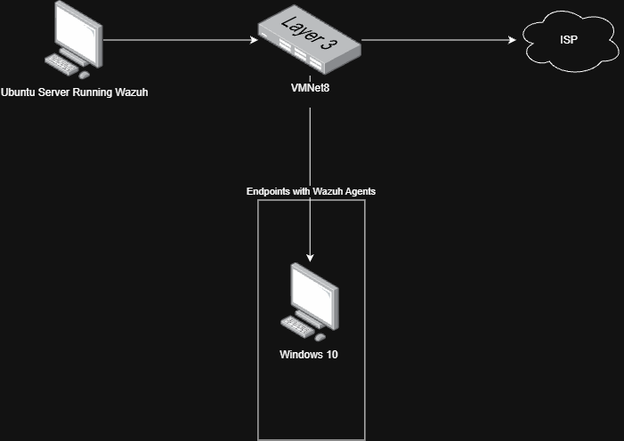
<!-- Insert lab topology diagram here -->

---

## 3. Wazuh Server Deployment

### 3.1 Installing Wazuh (All-in-One)

First we are going to download the wazuh script with the command

```bash
curl -sO https://packages.wazuh.com/4.14/wazuh-install.sh

```

After that we need to give the script the permission to execute on our machine 

```bash
chmod 700 ./wazuh-install.sh
```


The next step is to type in the all in one script in order to install Wazuh 
```bash
sudo bash wazuh-install.sh -a
```

At the end of the installation, the assistant printed the dashboard URL and the credentials for the `admin` user.


<!-- Insert screenshot of installation summary here (consider masking the password) -->

The passwords for all Wazuh users can be retrieved later with:

```bash
sudo tar -O -xvf wazuh-install-files.tar wazuh-install-files/wazuh-passwords.txt
```

### 3.4 Accessing the Wazuh Dashboard

The dashboard was accessed from the host browser at `https://192.168.17.132`, accepting the self-signed certificate warning and logging in as `admin`. At this stage, no agents were registered.

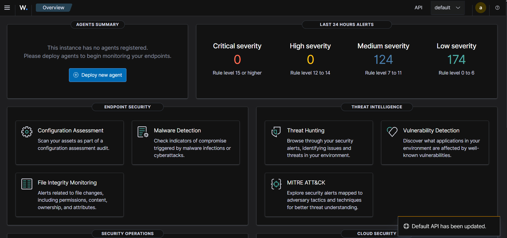
<!-- Insert screenshot here -->

---

## 4. Windows 10 Agent Enrolment

The agent was deployed from **Agents management → Deploy new agent** in the dashboard:

1. Selected **Windows (MSI 32/64 bits)** as the package.
2. Entered the Wazuh server IP as the server address.
3. Set the agent name to `WIN10` and kept the `default` agent group.
4. Copied the generated PowerShell command and ran it on the endpoint in an elevated PowerShell session.

```powershell
Invoke-WebRequest -Uri https://packages.wazuh.com/4.x/windows/wazuh-agent-4.14.8-1.msi -OutFile $env:tmp\wazuh-agent
msiexec.exe /i $env:tmp\wazuh-agent /q WAZUH_MANAGER='192.168.17.132' WAZUH_AGENT_NAME='WIN10'
NET START WazuhSvc
```

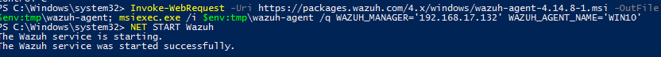
<!-- Insert screenshot here -->

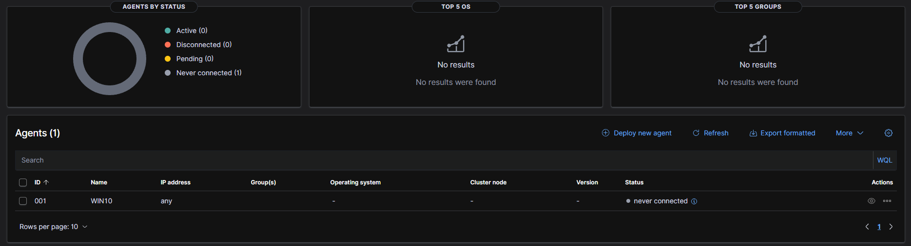
<!-- Insert screenshot here -->

---

## 5. Sysmon Deployment and Log Forwarding

### 5.1 Why Sysmon?

The Wazuh agent collects logs that Windows already produces. The default Windows logs (Security, System, Application) do not record detailed process creation chains, full command lines, per-process network connections, file hashes or registry modifications. Sysmon (System Monitor, part of Microsoft Sysinternals) is a system service and driver that records this activity in a dedicated event log (`Microsoft-Windows-Sysmon/Operational`). Wazuh ships with rules that analyse Sysmon events, making the combination essential for detecting the techniques emulated by Atomic Red Team.

### 5.2 Installing Sysmon

TLS 1.2 was enabled for the PowerShell session, then Sysmon and the SwiftOnSecurity configuration were downloaded and installed.

```powershell
cd $env:TEMP
Invoke-WebRequest https://download.sysinternals.com/files/Sysmon.zip -OutFile Sysmon.zip
Expand-Archive Sysmon.zip -DestinationPath Sysmon -Force
Invoke-WebRequest https://raw.githubusercontent.com/SwiftOnSecurity/sysmon-config/master/sysmonconfig-export.xml -OutFile Sysmon\sysmonconfig.xml
cd Sysmon
.\Sysmon64.exe -accepteula -i sysmonconfig.xml
```

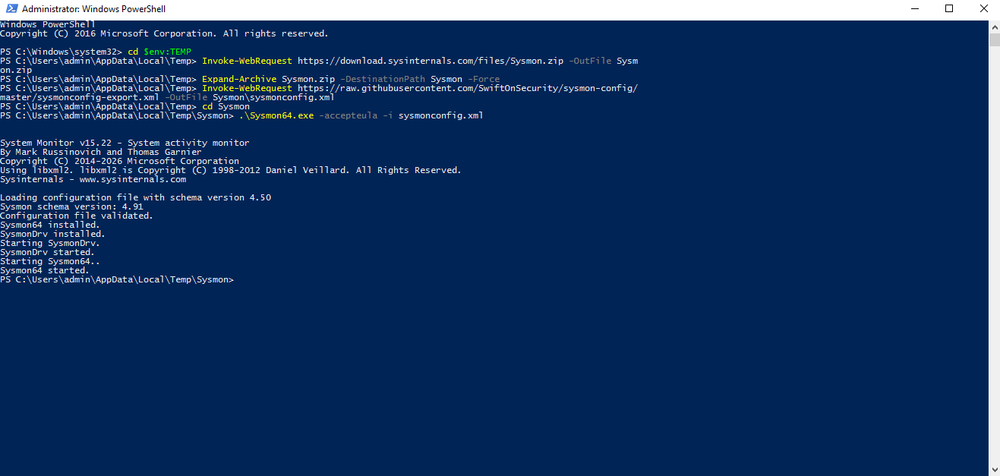
<!-- Insert screenshot here -->

Verification:

```powershell
Get-Service Sysmon64
Get-WinEvent -LogName "Microsoft-Windows-Sysmon/Operational" -MaxEvents 5
```

### 5.3 Forwarding Sysmon and PowerShell Logs to Wazuh

The agent configuration file was edited to collect two additional event channels:

```powershell
notepad "C:\Program Files (x86)\ossec-agent\ossec.conf"
```

The following block was added just before the closing `</ossec_config>` tag:

```xml
<localfile>
  <location>Microsoft-Windows-Sysmon/Operational</location>
  <log_format>eventchannel</log_format>
</localfile>
<localfile>
  <location>Microsoft-Windows-PowerShell/Operational</location>
  <log_format>eventchannel</log_format>
</localfile>
```

- `<localfile>` declares a log source for the agent to collect.
- `<location>` is the Windows event channel name.
- `<log_format>eventchannel</log_format>` tells the agent to parse it as a modern Windows Event Log so that fields such as EventID, Image and CommandLine are extracted.

The agent was then restarted:

```powershell
Restart-Service WazuhSvc
```

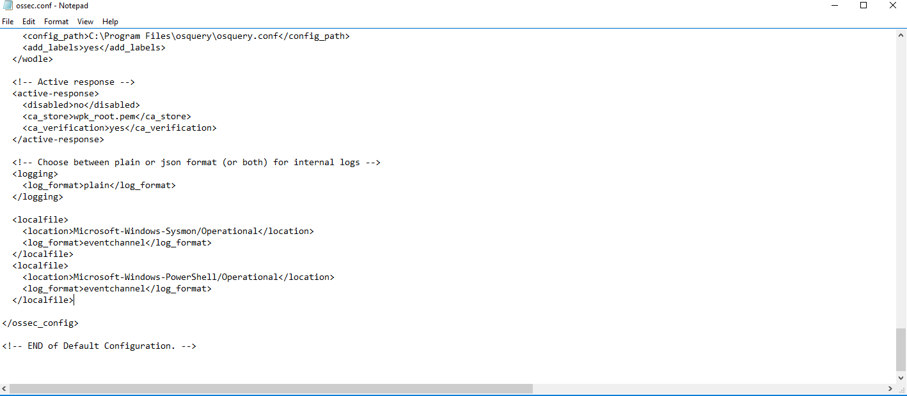
<!-- Insert screenshot here -->


---

## 6. Atomic Red Team Installation

### 6.1 Installing Invoke-AtomicRedTeam and the Atomics

```powershell
[Net.ServicePointManager]::SecurityProtocol = [Net.SecurityProtocolType]::Tls12
Set-ExecutionPolicy Bypass -Scope CurrentUser -Force
IEX (IWR 'https://raw.githubusercontent.com/redcanaryco/invoke-atomicredteam/master/install-atomicredteam.ps1' -UseBasicParsing)
Install-AtomicRedTeam -getAtomics
```

The framework was installed to `C:\AtomicRedTeam`, containing the `atomics` folder (test definitions) and the `invoke-atomicredteam` folder (PowerShell module).

```powershell
Test-Path C:\AtomicRedTeam
Get-ChildItem C:\AtomicRedTeam
```

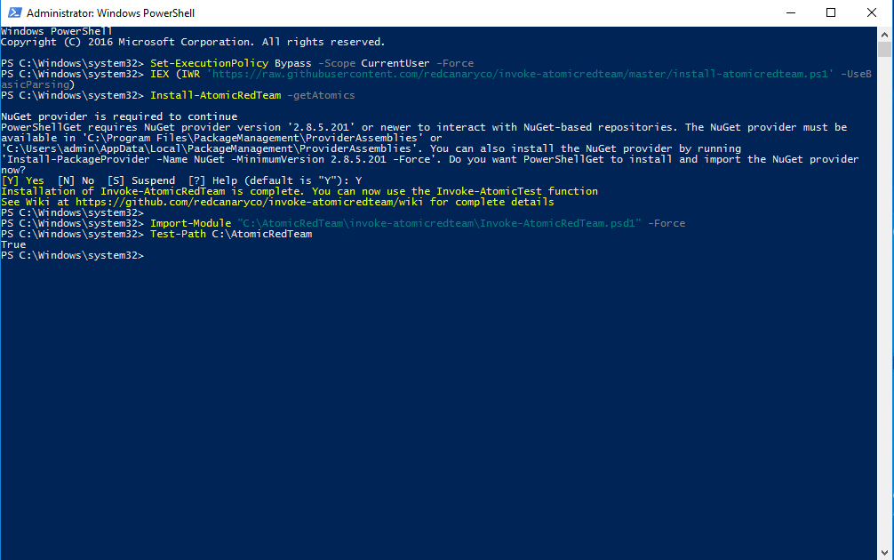
<!-- Insert screenshot here -->

To load the module automatically in every new PowerShell session, it was added to the PowerShell profile:

```powershell
New-Item -ItemType File -Path $PROFILE -Force
Add-Content $PROFILE 'Import-Module "C:\AtomicRedTeam\invoke-atomicredteam\Invoke-AtomicRedTeam.psd1" -Force'
```

---

## 7. VM Snapshots

Before running any tests, snapshots were taken on Windows virtual machines (**VM → Snapshot → Take Snapshot**) so that the environment could be reverted to a clean state after each round of testing.

| VM | Snapshot name | State captured |
|---|---|---|
| Windows 10 endpoint | `clean-sysmon-art` | Agent enrolled, Sysmon configured, Atomic Red Team installed, no tests executed |


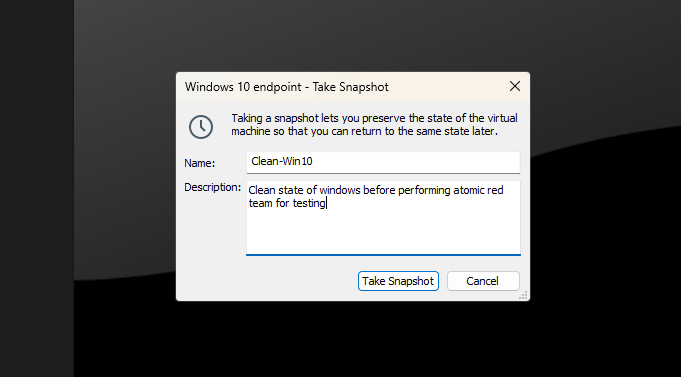
<!-- Insert screenshot here -->


---

## 8. Adversary Emulation: T1053.005 – Scheduled Task

### 8.1 Technique Overview

| Field | Value |
|---|---|
| Tactic | Persistence, Execution, Privilege Escalation |
| Technique | T1053.005 – Scheduled Task/Job: Scheduled Task |
| Atomic test | T1053.005-1 Scheduled Task Startup Script |
| Behaviour | Uses `cmd.exe` to run `schtasks /create` and registers two tasks (`T1053_005_OnLogon`, `T1053_005_OnStartup`) that launch `calc.exe` at logon and at system startup |

Adversaries abuse scheduled tasks to maintain persistence and to execute code with elevated privileges (e.g. as SYSTEM).

### 8.2 Executing the Test

```powershell
Import-Module "C:\AtomicRedTeam\invoke-atomicredteam\Invoke-AtomicRedTeam.psd1" -Force

# List the tests available for this technique
Invoke-AtomicTest T1053.005 -ShowDetailsBrief

# Review the commands test 1 will run
Invoke-AtomicTest T1053.005 -TestNumbers 1 -ShowDetails

# Check prerequisites and execute
Invoke-AtomicTest T1053.005 -TestNumbers 1 -GetPrereqs
Invoke-AtomicTest T1053.005 -TestNumbers 1
```

The test completed with exit code 0 and both scheduled tasks were created successfully.

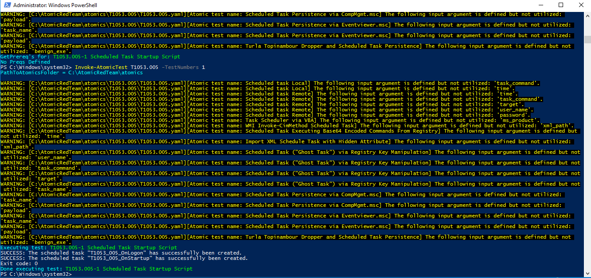
<!-- Insert screenshot here -->

### 8.3 Initial Detection Results

The resulting alerts were reviewed in **Threat Hunting → Events**, filtered on `agent.name: WIN10`. Note that this view reads from the `wazuh-alerts-*` index, so every row shown is an alert generated by a Wazuh rule.

| Rule ID | Level | Description |
|---|---|---|
| 92052 | 4 | Windows command prompt started by an abnormal process |
| 92032 | 3 | Suspicious Windows cmd shell execution |

<!-- Insert screenshot here -->

### 8.4 Gap Analysis

Wazuh's built-in rules detected the suspicious `cmd.exe` execution, but no alert explicitly identified the creation of a scheduled task, and none was mapped to MITRE ATT&CK T1053.005. An analyst would therefore have to inspect the raw command line to recognise the persistence behaviour. This represents a detection gap for a common persistence technique.

---

## 9. Custom Detection Rule

### 9.1 Rule Definition

A custom rule was added on the Wazuh server to raise a dedicated, higher-severity alert whenever `schtasks.exe` is executed with the `/create` argument.

```bash
sudo nano /var/ossec/etc/rules/local_rules.xml
```

```xml
<group name="windows,sysmon,">
  <rule id="100100" level="10">
    <if_group>sysmon_event1</if_group>
    <field name="win.eventdata.image" type="pcre2">(?i)\\schtasks\.exe$</field>
    <field name="win.eventdata.commandLine" type="pcre2">(?i)/create</field>
    <description>Scheduled task created via schtasks: $(win.eventdata.commandLine)</description>
    <mitre>
      <id>T1053.005</id>
    </mitre>
  </rule>
</group>
```

| Element | Purpose |
|---|---|
| `if_group sysmon_event1` | Only evaluates Sysmon Event ID 1 (process creation) |
| `win.eventdata.image` | Matches the process image ending in `schtasks.exe` (case-insensitive) |
| `win.eventdata.commandLine` | Requires the `/create` argument |
| `level="10"` | Raises the alert to medium severity |
| `$(win.eventdata.commandLine)` | Includes the full command line in the alert description |
| `<mitre>` | Maps the alert to T1053.005 |

The Wazuh manager was restarted to load the rule:

```bash
sudo systemctl restart wazuh-manager
```


### 9.2 Validation

The previous test artefacts were removed and the test was executed again:

```powershell
Invoke-AtomicTest T1053.005 -TestNumbers 1 -Cleanup
Invoke-AtomicTest T1053.005 -TestNumbers 1
```

The custom rule fired for both scheduled task creations:

| Rule ID | Level | Description |
|---|---|---|
| 100100 | 10 | Scheduled task created via schtasks: `schtasks /create /tn "T1053_005_OnStartup" /sc onstart /ru system /tr "cmd.exe /c calc.exe"` |
| 100100 | 10 | Scheduled task created via schtasks: `schtasks /create /tn "T1053_005_OnLogon" /sc onlogon /tr "cmd.exe /c calc.exe"` |
| 92052 | 4 | Windows command prompt started by an abnormal process |

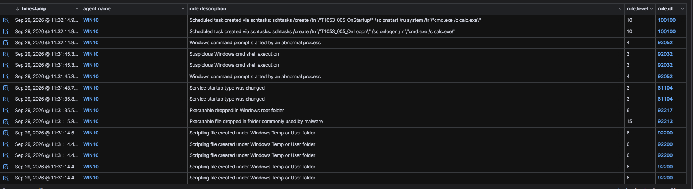
<!-- Insert screenshot here -->

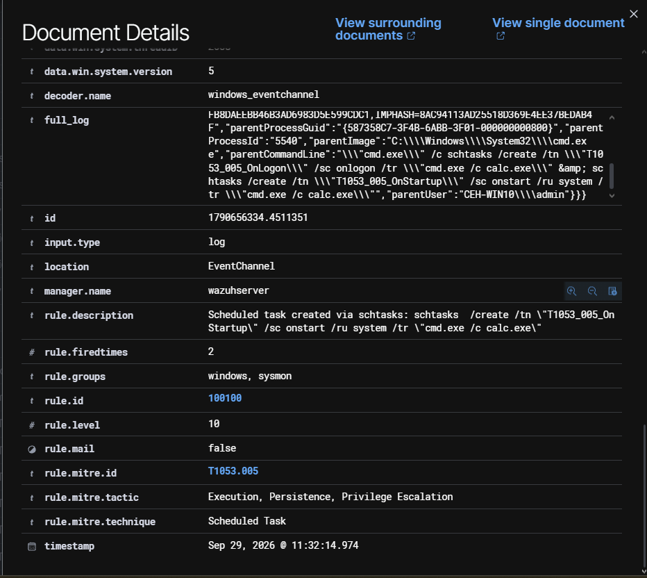
<!-- Insert screenshot of the expanded alert document here -->

---

## 10. Cleanup

The artefacts created by the atomic test were removed and the result was verified:

```powershell
Invoke-AtomicTest T1053.005 -TestNumbers 1 -Cleanup
schtasks /query | findstr T1053
```

No output from the second command confirmed that both scheduled tasks had been deleted. The Windows 10 VM can be reverted to the `clean-sysmon-art` snapshot before the next round of testing.

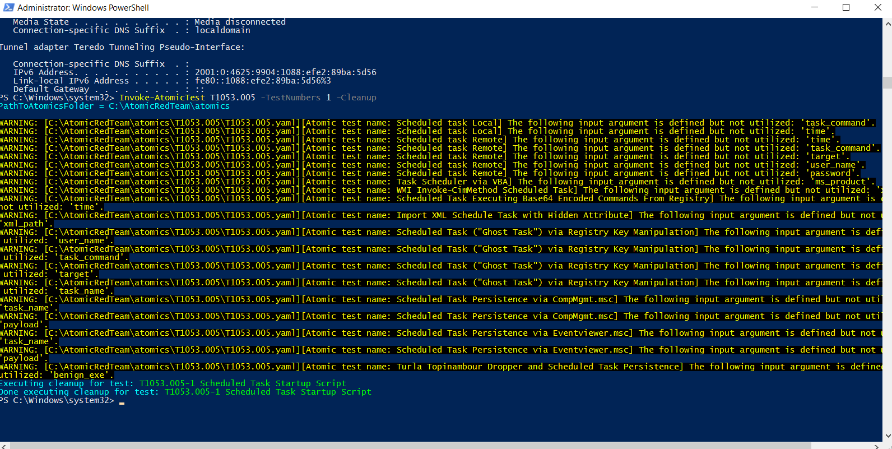
<!-- Insert screenshot here -->

---

## 11. Conclusion

A functional detection lab was built with Wazuh 4.14.8, a Windows 10 agent and Sysmon. Using Atomic Red Team to emulate T1053.005, the lab showed that the default ruleset detected the suspicious command shell activity but did not explicitly identify scheduled task persistence or map it to MITRE ATT&CK. A custom rule based on Sysmon process creation events closed this gap, producing a level 10 alert with the full command line and a T1053.005 mapping.

This workflow (emulate, observe, identify gaps, write detections, validate) forms a repeatable loop for improving detection coverage.

### 11.1 Future Work

- Emulate additional techniques (e.g. T1059.001 PowerShell, T1003.001 LSASS memory dumping, T1547.001 Registry Run Keys) and repeat the gap analysis.
- Evaluate a more verbose Sysmon configuration (e.g. sysmon-modular) for broader coverage.
- Enable PowerShell Script Block Logging for deeper visibility into script content.
- Configure Wazuh integrations (email, Slack or Telegram) for real-time alert notification.

---

## References

- Wazuh Documentation – Quickstart: https://documentation.wazuh.com/current/quickstart.html
- Microsoft Sysinternals – Sysmon: https://learn.microsoft.com/sysinternals/downloads/sysmon
- SwiftOnSecurity Sysmon configuration: https://github.com/SwiftOnSecurity/sysmon-config
- Red Canary – Atomic Red Team: https://github.com/redcanaryco/atomic-red-team
- Red Canary – Invoke-AtomicRedTeam: https://github.com/redcanaryco/invoke-atomicredteam
- MITRE ATT&CK – T1053.005 Scheduled Task: https://attack.mitre.org/techniques/T1053/005/